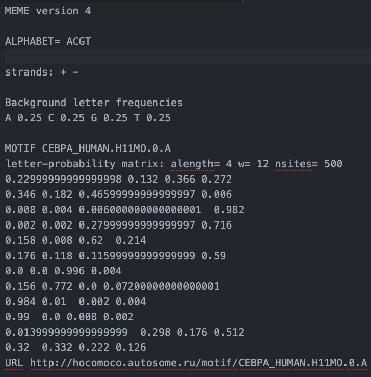
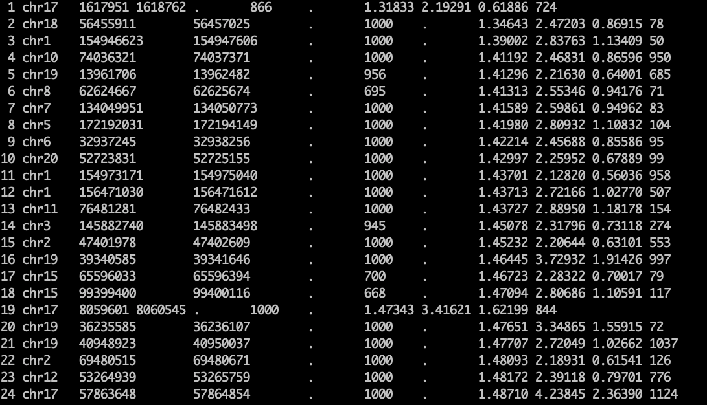

# Data description

# input

## 1 motif pwm

### example data

### directory
./DNASE-seq/DNASE.A549.conservative.narrowPeak.gz

### description link
https://hocomoco11.autosome.ru/help

## 2 DNASE-seq

### example data: narrow peak

### directory
./DNASE-seq/DNASE.A549.conservative.narrowPeak.gz

### description link

https://genome.ucsc.edu/FAQ/FAQformat.html

## 3 WGBS

### example data: tile50 methylation data

update later

### data now:
sigle cpg bed file

### directory
./WGBS/example_WGBS.bed

### data description:
https://www.encodeproject.org/documents/964e2676-d0be-4b5d-aeec-f4f02310b221/@@download/attachment/WGBS%20pipeline%20overview.pdf

# output

the binding situation label

### directory
./output_label/label_example_data.txt

more information:https://www.synapse.org/#!Synapse:syn6131484/wiki/402033
